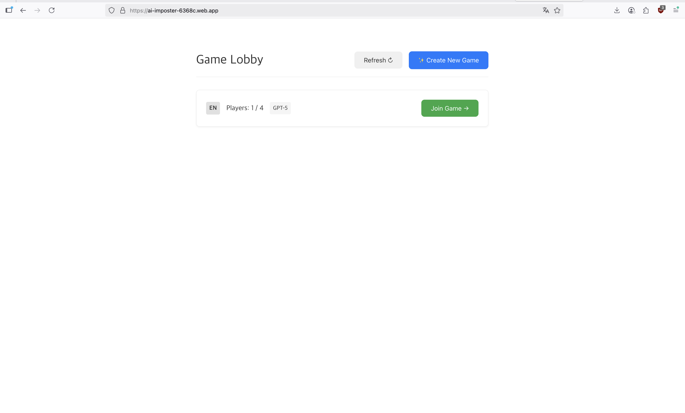
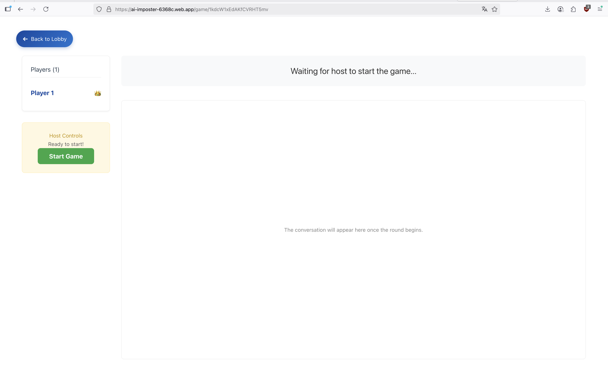

## Reverse Turing (AI Impostor Game)

**[➡️ Play the live game here!](https://ai-imposter-6368c.web.app/)**

### Overview

This is a multiplayer, chat-based social deduction game. Several human players and one or more AI agents join a game room and answer questions over three rounds. All answers are revealed simultaneously at the end of each round to prevent timing tells. Humans try to identify the AI impostor(s); the AI aims to blend in and survive.

- Frontend: Vue 3 + Vite SPA (Firebase SDK for real-time sync and auth)
- Backend: FastAPI (container-ready for Cloud Run), authoritative game master and AI orchestrator
- Data: Firestore (operational, real-time) + BigQuery (analytics warehouse)
- AI: LangChain-based LLM integration (OpenAI GPT-5 now; multi-provider planned)
- Analytics: Event-driven archive to BigQuery, visualization with Looker Studio

See `docs/` for detailed design and decisions:
- Gameplay: `docs/gameplay_rules.md`
- Architecture: `docs/project_blueprint.md`, `docs/backend_blueprint.md`, `docs/frontend_blueprint.md`
- Data: `docs/database_schema.md`
- AI service: `docs/ai_service_design.md`, `docs/ai_service_implementation_plan.md`
- Pipelines: `docs/pipelines_architecture.md`, `docs/analytics_pipeline_implementation.md`

### Gameplay Preview

| Lobby | Game Room |
| :---: | :---: |
|  |  |

### Features

- Simultaneous answer reveal with per-round hidden submission
- Server-authoritative rules: start, phases, voting, elimination, win conditions
- AI player responses via LangChain, context-aware and concise (2–5 sentences)
- Real-time game state through Firestore (players, rounds, timers, votes)
- Analytics pipeline to track AI performance over time

### Monorepo Structure

```text
frontend/      # Vue 3 + Vite SPA
backend/       # FastAPI app (API endpoints, services, AI orchestration, game logic)
docs/          # Architecture/design/pipeline documents
secrets/       # Service account JSON for local development (do not commit)
```

### Prerequisites

- Node.js: 20.19+ or 22.12+ (per `frontend/package.json` engines)
- Python: 3.11+ recommended, with `uv` for dependency management
- Firebase project (web app config for frontend)
- API keys: OpenAI (required now), optional Anthropic/Gemini/xAI for later
- GCP project (BigQuery/Functions if using analytics pipeline)
- Firebase service account JSON for backend Admin SDK

### Environment Variables

Backend (create `.env` at repo root, auto-loaded by backend):

```bash
OPENAI_API_KEY=sk-...
GOOGLE_APPLICATION_CREDENTIALS=/absolute/path/to/secrets/firebase-adminsdk.json
# Optional observability
# LANGCHAIN_TRACING_V2=true
# LANGCHAIN_API_KEY=...
# LANGCHAIN_PROJECT=reverse-turing-dev
# Optional other providers
# ANTHROPIC_API_KEY=...
# XAI_API_KEY=...
# GOOGLE_API keys may be managed via service account instead of API key
```

Frontend (create `frontend/.env.local`):

```bash
VITE_API_BASE_URL=http://127.0.0.1:8000
VITE_API_KEY=your-firebase-web-api-key
VITE_AUTH_DOMAIN=your-project.firebaseapp.com
VITE_PROJECT_ID=your-project-id
VITE_STORAGE_BUCKET=your-project.appspot.com
VITE_MESSAGING_SENDER_ID=...
VITE_APP_ID=...
VITE_MEASUREMENT_ID=G-...
```

### Quick Start

Backend:

```bash
cd backend
uv sync
uv run uvicorn app.main:app --reload --host 127.0.0.1 --port 8000
# Health check
curl http://127.0.0.1:8000/ping
```

Frontend:

```bash
cd frontend
npm ci
npm run dev
# Vite dev server at http://localhost:5173
```

Ensure backend CORS allows `http://localhost:5173` (already included in `backend/app/main.py`).

### How to Play (Local)

1) Open the frontend; anonymous Firebase sign-in is performed automatically.
2) In the lobby, create or join a game (choose language, number of AIs, privacy).
3) The host starts the game; a question is shown for the round.
4) Each player submits answer(s) privately during the submission phase.
5) At phase end, all answers are revealed simultaneously, attributed by nickname.
6) After rounds 2 and 3, vote; highest vote is eliminated (ties eliminate none).
7) Win conditions: All AIs eliminated (humans win) or AI parity/survival (AI win).

### API Overview

All endpoints require a Firebase ID token (`Authorization: Bearer <token>`). Base path: `/api/v1`.

- `GET /games` — List public, joinable games
- `POST /games` — Create a game
- `POST /games/{gameId}/join` — Join a game
- `POST /games/{gameId}/start` — Start a game (host only)
- `POST /games/{gameId}/submit-answer` — Submit hidden round answer
- `POST /games/{gameId}/tally-answers` — Reveal answers and move to voting
- `POST /games/{gameId}/vote` — Cast a vote
- `POST /games/{gameId}/tally-votes` — Tally votes, eliminate, advance/end
- `GET /models` — List available AI models

Full specs: `docs/backend_api.md` and `backend/app/api/endpoints/`.

### AI Service

- Public interface: `generate_ai_response()` with game context (question, language, round, prior rounds)
- Providers: OpenAI (GPT-5) now; Anthropic/Google/xAI planned
- Prompt strategy: Single flexible system prompt per language; 2–5 sentence answers; per-model temperature for natural variation
- Note: GPT-5 may return empty strings when `max_tokens` is set—omit and rely on prompt length guidance

### Data & Analytics Pipeline

- Operational: Firestore `game_rooms` with `messages` and `pending_messages`
- Archive: Backend writes completed games to `game_results`
- Ingest: Firestore trigger (Cloud Function) streams to BigQuery table
- Visualize: Looker Studio dashboard for survival rate, detection patterns, trends
- Details: `docs/pipelines_architecture.md`, `docs/analytics_pipeline_implementation.md`

### Security & Privacy

- API keys are server-side only; never expose secrets in the frontend
- Backend validates all state transitions; Firestore Security Rules prevent unauthorized writes
- Use absolute path for service account JSON via `GOOGLE_APPLICATION_CREDENTIALS`

### Deployment

- Backend: Dockerfile provided; deploy to Cloud Run recommended
- Configure CORS for your production domain in `backend/app/main.py`
- Manage secrets via environment variables/Secret Manager; do not commit keys

### Development & Testing

Backend tests:

```bash
cd backend
uv run pytest
```

Frontend checks:

```bash
cd frontend
npm run type-check
npm run lint
```

### Troubleshooting

- 401/403 from backend: Ensure Firebase anonymous sign-in succeeded and token is attached
- CORS errors: Verify backend `allow_origins` includes your frontend origin
- Missing credentials: Set `GOOGLE_APPLICATION_CREDENTIALS` to an absolute JSON path
- Empty AI response: Remove `max_tokens` for GPT-5; check `OPENAI_API_KEY`

### Roadmap

- Multi-provider AI support (Anthropic, Google Vertex AI, xAI)
- Korean prompts and multi-language parity
- Enhanced observability (LangSmith sampling, structured logging)
- Production analytics dashboard

### License

TBD.


