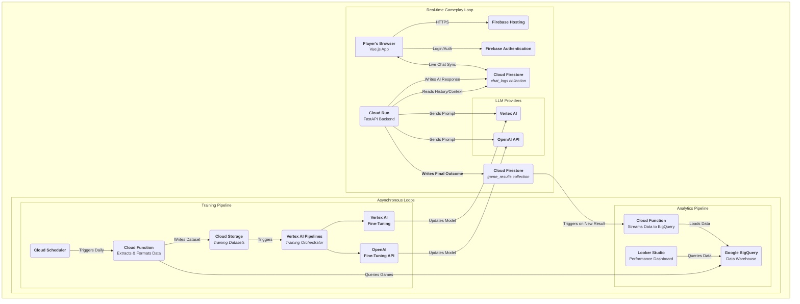
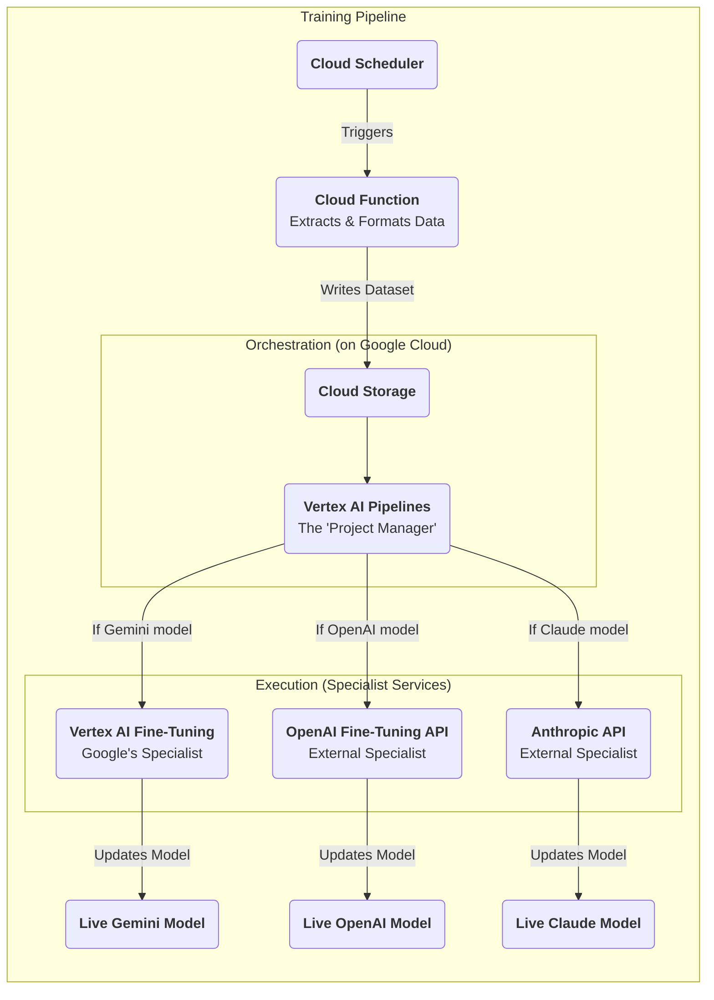

# Data & AI Training Pipeline Architecture

This document outlines the architecture for the two critical, asynchronous pipelines that support the AI Impostor Game: the AI Performance Analytics Pipeline and the Asynchronous Training Pipeline.

## 1. High-Level Strategy

The system is designed around two distinct but sequential pipelines:

1.  **AI Performance Analytics Pipeline:** An event-driven workflow that captures the result of every completed game and archives it in a long-term analytical data warehouse.
2.  **Asynchronous Training Pipeline:** A scheduled workflow that uses the data collected by the analytics pipeline to automatically fine-tune the AI models, creating a continuous learning loop.

## 2. Overall Architecture Diagram

This diagram illustrates how the real-time gameplay loop feeds data into the two asynchronous pipelines.

## 3. AI Performance Analytics Pipeline (Detailed Flow)

This pipeline is designed for data capture and archival.

1.  **Trigger:** The process begins when a game finishes. The FastAPI backend writes a final summary document to the `game_results` collection in Firestore.
2.  **Ingestion:** A Cloud Function is configured to trigger automatically whenever a new document is added to this collection.
3.  **Data Warehouse:** The Cloud Function's sole responsibility is to stream the game result data into a table in Google BigQuery. BigQuery serves as the permanent, analytical data store.
4.  **Visualization:** A Looker Studio dashboard is connected to the BigQuery table. This provides a user-friendly interface for monitoring and comparing the performance of different AI models over time.

## 4. Asynchronous Training Pipeline (Detailed Flow)

This pipeline is designed for automated model improvement. It clarifies the distinction between orchestration and execution.

### 4.1. Orchestration vs. Execution

*   **Orchestration:** The entire workflow is *managed* from a central point on Google Cloud using a tool like Vertex AI Pipelines. This orchestrator acts as a "project manager," starting the workflow and directing tasks.
*   **Execution:** The actual, computationally intensive fine-tuning is performed by *specialist services*. For Google models, this is the Vertex AI Fine-Tuning service. For external models (from OpenAI, Anthropic, etc.), this requires an API call to their respective proprietary fine-tuning services.

### 4.2. Step-by-Step Flow

1.  **Trigger:** A Cloud Scheduler job initiates the pipeline on a recurring schedule (e.g., daily).
2.  **Data Extraction:** The scheduler triggers a Cloud Function that queries the BigQuery data warehouse. It selects data from successful games (e.g., where the AI survived) to use as training material.
3.  **Data Formatting:** This function formats the retrieved chat logs and game data into the specific structured format (e.g., JSONL) required by the target model provider's fine-tuning API.
4.  **Dataset Storage:** The formatted dataset is uploaded to a designated bucket in Cloud Storage.
5.  **Orchestration:** The upload to Cloud Storage triggers a Vertex AI Pipeline. This pipeline reads the dataset and determines which model provider it belongs to.
6.  **Execution:** The pipeline makes a branched call to the appropriate execution service:
    *   If it's a Gemini model, it calls the native **Vertex AI Fine-Tuning** service.
    *   If it's an OpenAI model, it makes an API call to the **OpenAI Fine-Tuning API**.
    *   If it's a Claude model, it makes an API call to the **Anthropic API**.
7.  **Model Deployment:** Upon successful completion of the fine-tuning job, the new, improved model version is registered. The main application can then be updated to use this new version, completing the learning loop.

### 4.3. Training Pipeline Diagram

This diagram explicitly shows the relationship between the orchestrator and the specialist execution services.

