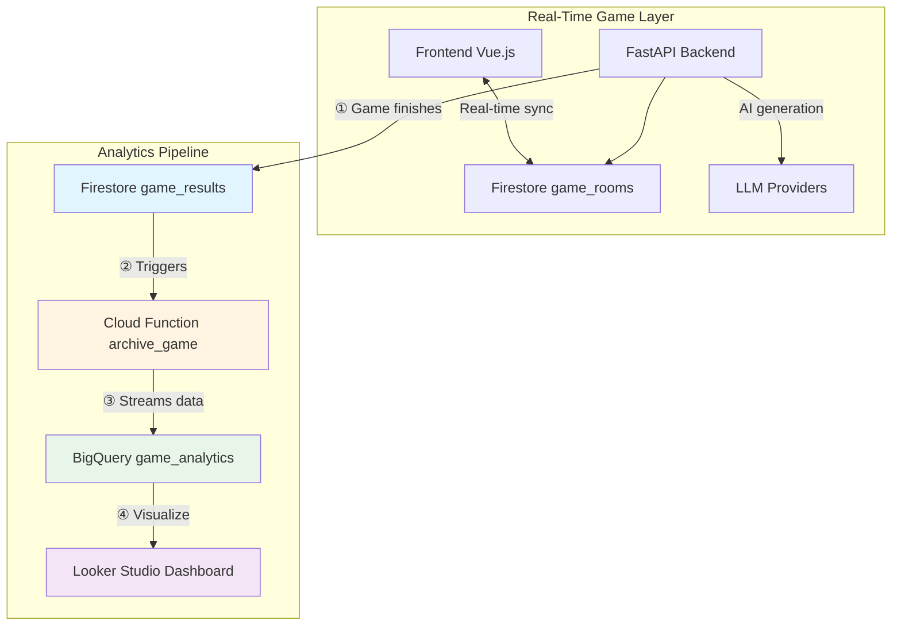
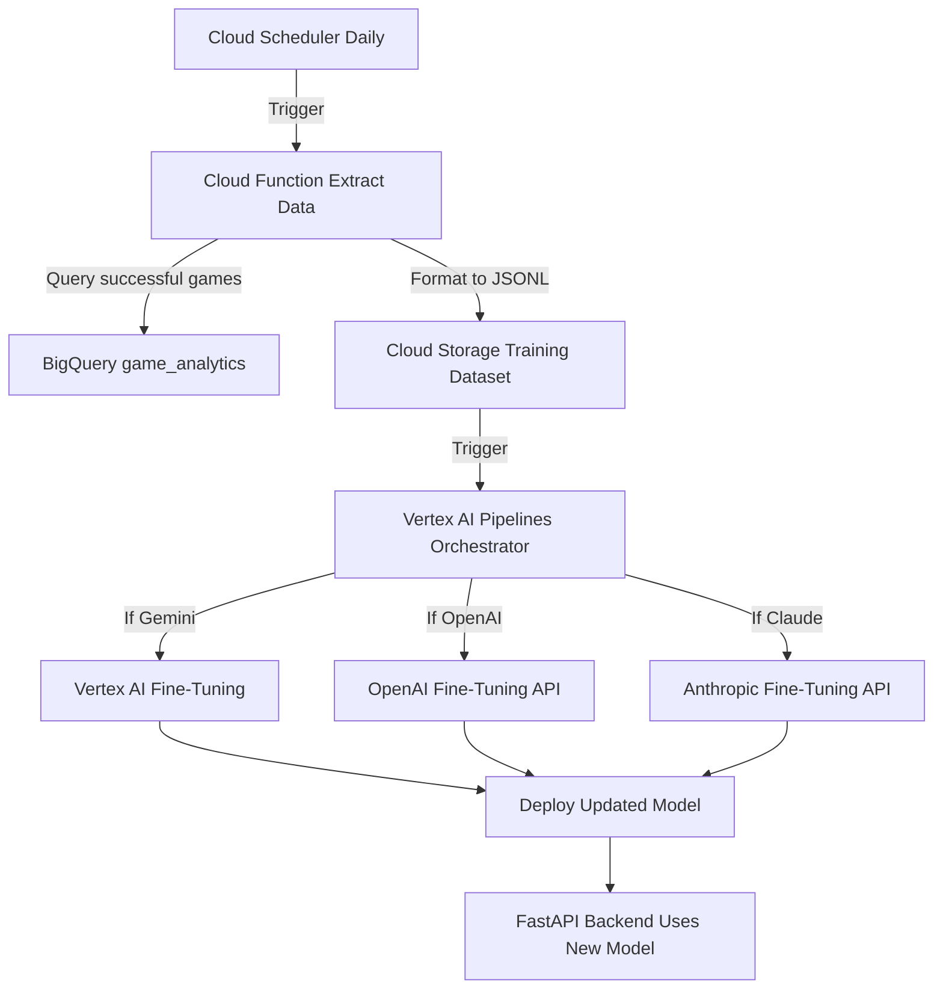

# Data Pipeline Architecture

**Last Updated:** October 14, 2025
**Status:** Phase 1 (Analytics Pipeline) - Ready for Implementation

This document outlines the phased approach for building data pipelines that transform the AI Impostor Game from a black box into a data-driven research platform.

---

## 1. Executive Summary

### Goals

The data pipeline achieves four primary objectives:

1. **Measure AI Performance** - Track which models are better at deceiving humans
2. **Enable Iteration** - Identify patterns that make AIs detectable
3. **Build Training Corpus** - Create datasets of successful AI responses for future fine-tuning
4. **Justify Decisions** - Use data to guide model selection, prompt engineering, and feature development

### Success Metrics

Pipeline is successful when we can answer:
- ✅ Which AI model has the highest survival rate?
- ✅ What patterns correlate with AI elimination?
- ✅ How does AI performance change over time?
- ✅ What round do AIs typically get caught?

### Phased Approach

| Phase | Purpose | Timeline | Complexity |
|-------|---------|----------|-----------|
| **Phase 1: Analytics Pipeline** | Data capture & visualization | **MVP (Now)** | Low (3-5 days) |
| **Phase 2: Training Pipeline** | Automated model fine-tuning | **Future** | High (2-3 weeks) |

**Rationale:** Start with analytics to understand what data you have and prove value before investing in complex ML infrastructure.

---

## 2. Phase 1: Analytics Pipeline (MVP)

### 2.1. Architecture Overview

The Analytics Pipeline is an **event-driven, fully automated workflow** that archives every completed game to a data warehouse for analysis.



### 2.2. Data Flow

#### Step 1: Game Completion Trigger

When a game finishes, the backend writes a result document to Firestore:

```python
# In game_service.py tally_votes() when game ends
if game_is_over:
    db.collection('game_results').add({
        'gameId': game_id,
        'endedAt': firestore.SERVER_TIMESTAMP,
        'language': game_data['language'],
        'aiModelUsed': game_data['aiModelId'],
        'winner': 'humans' or 'ai',
        'players': game_data['players'],
        'rounds': game_data['rounds'],
        'votes': game_data['votes'],
        'messages': extract_full_chat_log(game_ref)
    })
```

#### Step 2: Cloud Function Activation

A Cloud Function triggers automatically on new `game_results` documents:

```python
@functions_framework.cloud_event
def archive_game(cloud_event):
    """
    Triggered by Firestore onCreate event.
    Archives game data to BigQuery for permanent storage.
    """
    # Extract game data from event
    game_data = cloud_event.data['value']['fields']

    # Minimal transformation (pass-through pattern)
    bq_row = transform_to_bigquery_schema(game_data)

    # Stream to BigQuery
    bigquery_client.insert_rows_json('game_analytics', [bq_row])

    logger.info(f"Archived game {bq_row['gameId']} to BigQuery")
```

#### Step 3: BigQuery Storage

Data is stored permanently in a denormalized table optimized for analytics:

```sql
CREATE TABLE game_analytics (
  gameId STRING NOT NULL,
  endedAt TIMESTAMP NOT NULL,
  language STRING NOT NULL,
  aiModelUsed STRING NOT NULL,
  winner STRING NOT NULL,

  -- Player and round data as nested arrays
  players ARRAY<STRUCT<
    uid STRING,
    gameDisplayName STRING,
    isImpostor BOOLEAN,
    isEliminated BOOLEAN
  >>,

  -- Full chat log for future training
  messages ARRAY<STRUCT<
    roundNumber INT64,
    senderId STRING,
    senderName STRING,
    text STRING,
    timestamp TIMESTAMP
  >>
)
```

#### Step 4: Looker Studio Visualization

Connect dashboard directly to BigQuery to visualize:
- AI survival rate by model
- Detection patterns by round
- Performance trends over time
- Language differences (EN vs KO)

### 2.3. Design Principles

#### Principle 1: Separation of Concerns

| Layer | Purpose | Technology | Data Lifespan |
|-------|---------|-----------|---------------|
| **Operational** | Real-time gameplay | `game_rooms` (Firestore) | Temporary (15-30 min TTL) |
| **Staging** | Post-game results | `game_results` (Firestore) | Short (7 days, then TTL deleted) |
| **Analytical** | Historical archive | `game_analytics` (BigQuery) | Permanent |

**Why three layers?**
- `game_rooms`: Optimized for real-time sync (millisecond latency)
- `game_results`: Easy trigger mechanism, failure resilience
- BigQuery: Optimized for analytical queries (aggregations, time-series)

#### Principle 2: Event-Driven Architecture

**Benefits:**
- ✅ **Zero manual intervention** - Fully automated
- ✅ **Low latency** - Data available within seconds
- ✅ **Cost-efficient** - Only runs when games finish
- ✅ **Scalable** - Handles 1 game/day or 1000 games/day identically

#### Principle 3: Immutable Data

Once written to BigQuery, data never changes:
- ✅ **Reproducibility** - Can re-run analyses on historical data
- ✅ **Audit trail** - Track AI performance evolution over time
- ✅ **Simplicity** - No UPDATE operations, only INSERT

#### Principle 4: Minimal Transformation

Cloud Function does minimal processing (pass-through pattern):
- ✅ **Simplicity** - Less code, fewer bugs
- ✅ **Fast execution** - Low latency
- ✅ **Flexibility** - Calculations done in SQL (easier to evolve)

Let BigQuery handle complex calculations - it's designed for that.

### 2.4. Error Handling Strategy

**Scenario:** Cloud Function fails to write to BigQuery

**Recovery Strategy:**
1. **Auto-retry** - Cloud Functions retry failed events up to 7 days
2. **Dead Letter Queue** - Failed writes go to `failed_archives` Firestore collection
3. **Manual recovery** - Periodic script retries failed archives
4. **Monitoring** - Cloud Logging alerts on repeated failures

```python
try:
    bigquery_client.insert_rows_json('game_analytics', [bq_row])
except Exception as e:
    logger.error(f"Failed to archive game {game_id}: {e}")
    # Write to failed_archives for manual recovery
    db.collection('failed_archives').add({
        'gameId': game_id,
        'originalData': game_data,
        'error': str(e),
        'timestamp': firestore.SERVER_TIMESTAMP
    })
    raise  # Re-raise to trigger Cloud Functions retry
```

### 2.5. Cost Estimate (Phase 1)

| Service | Usage (Monthly) | Cost |
|---------|----------------|------|
| Firestore `game_results` | 1000 games, 100KB each, 7-day TTL | $0.50 |
| Cloud Function | 1000 invocations, 512MB, <1s | $0.10 |
| BigQuery Storage | 1GB data (first year) | $0.02 |
| BigQuery Queries | 10GB scanned (dashboard usage) | $0.05 |
| **Total** | | **~$0.67/month** |

**Negligible cost for MVP.**

---

## 3. Phase 1 Implementation Plan

### Phase 1.1: Foundation (Days 1-2)

**Goal:** Get first game into BigQuery

**Tasks:**
1. Create `game_results` Firestore collection structure
2. Update `tally_votes()` to write results when game finishes
3. Create BigQuery dataset and `game_analytics` table
4. Deploy basic Cloud Function (pass-through transformation)
5. Test with one complete playthrough

**Success Criteria:** One game successfully archived in BigQuery

---

### Phase 1.2: Dashboard (Days 3-4)

**Goal:** Visualize AI performance

**Tasks:**
1. Design key metrics queries:
   - Survival rate by model
   - Elimination round distribution
   - Human detection accuracy
2. Create Looker Studio dashboard with filters (model, language, date)
3. Play 10+ test games to populate meaningful data

**Success Criteria:** Working dashboard showing AI performance trends

---

### Phase 1.3: Production Hardening (Day 5)

**Goal:** Make pipeline reliable and autonomous

**Tasks:**
1. Add comprehensive error handling and retry logic
2. Set up Cloud Logging monitoring and alerts
3. Add TTL to `game_results` (delete after 7 days once archived)
4. Document operational procedures

**Success Criteria:** Pipeline runs 1 week without manual intervention

---

## 4. Phase 2: Training Pipeline (Future)

### 4.1. When to Build Phase 2

**Prerequisites:**
- ✅ 100+ games archived in BigQuery
- ✅ Clear understanding of which AI response patterns succeed
- ✅ Decision made on which models to fine-tune (ROI analysis)
- ✅ Budget allocated for training compute costs

**Timeline:** 2-3 weeks of engineering work

### 4.2. Architecture Overview



### 4.3. Key Decisions (To Be Made Later)

1. **Training Data Selection:**
   - Only successful games (AI survived)?
   - Include failures for negative examples?
   - How many examples needed per model?

2. **Fine-Tuning Strategy:**
   - Full fine-tuning vs LoRA?
   - Which base models to customize?
   - Evaluation metrics for model quality?

3. **Deployment Strategy:**
   - A/B test new models vs old?
   - Gradual rollout or immediate switch?
   - Rollback procedure if performance degrades?

**These decisions will be informed by Phase 1 analytics data.**

---

## 5. Key Architectural Decisions

### Decision 1: Firestore Staging Layer

**Choice:** Use Firestore `game_results` as staging before BigQuery

**Rationale:**
- Easy to write from existing backend (already using Firestore)
- Built-in Cloud Function triggers (no custom monitoring)
- Provides failure resilience (can retry if BigQuery load fails)
- Minimal additional cost with TTL cleanup

**Alternative Considered:** Direct BigQuery write (rejected for tight coupling)

---

### Decision 2: Nested vs Flattened Schema

**Choice:** Nested ARRAY schema for Phase 1

```sql
messages ARRAY<STRUCT<...>>  -- One row per game
```

**Rationale:**
- Simpler queries for "all messages in a game"
- Matches Firestore document structure
- Easier to implement initially

**Migration Path:** If Phase 2 needs per-message queries, extract to separate table

---

### Decision 3: Real-Time vs Batched Loading

**Choice:** Real-time event-driven loading

**Rationale:**
- Enables faster iteration (data available immediately)
- Not at scale where batching saves meaningful cost
- Aligns with event-driven architecture principle

**Monitoring:** If hitting BigQuery streaming quotas, batch into hourly loads

---

### Decision 4: Transformation Location

**Choice:** Minimal transformation in Cloud Function, calculations in SQL

**Rationale:**
- Simpler function code (less bugs)
- Fast execution (low latency)
- BigQuery is optimized for calculations
- Easy to evolve metrics without redeploying functions

---

## 6. Success Criteria

### Phase 1 Complete When:

- ✅ Every finished game automatically appears in BigQuery within 60 seconds
- ✅ Dashboard shows survival rate by AI model
- ✅ Can query "Show me all games where GPT-5 survived to round 3"
- ✅ Pipeline has run for 1 week without manual intervention
- ✅ Zero data loss (every game archived or in failed_archives for recovery)

---

## 7. Next Steps

**Immediate:** Begin Phase 1.1 implementation
1. Define `game_results` Firestore schema
2. Update backend to write results on game completion
3. Create BigQuery dataset and table
4. Deploy Cloud Function for archival

**Future Consideration:** Phase 2 training pipeline (revisit after 100+ games)

---

**Document Status:** Phase 1 design complete and approved. Ready for implementation.
