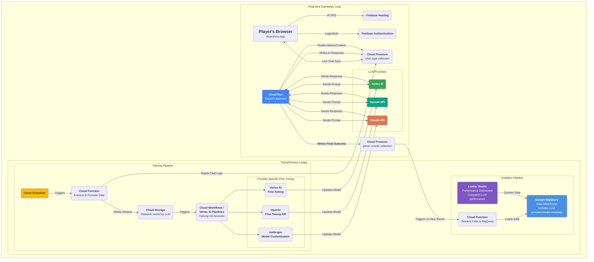

# Project Blueprint: AI Impostor Game

- **Last Updated:** August 29, 2025
- **Project Lead:** AI Software Engineer

## Detailed Design Documents

For specific, in-depth design details, please refer to the following documents:
*   [**Gameplay Rules & Flow**](./gameplay_rules.md)
*   [**Database Schema & Design**](./database_schema.md)
*   [**Frontend Blueprint**](./frontend_blueprint.md)
*   [**Backend Blueprint**](./backend_blueprint.md)

## 1. Project Overview & Goals

### 1.1. Core Concept
This project is a multiplayer, chat-based social deduction game. A small group of human players (e.g., ~5) enter a game room and are joined by one or more AI agents disguised as human players. The game proceeds in turns, with a topic or question presented to the group. The primary goal for the human players is to correctly identify the AI impostor(s). The AI's goal is to remain undetected.

### 1.2. Key Objectives
- **Feasibility:** Develop a functional prototype with a simple, messenger-like interface.
- **Multi-LLM Integration:** Utilize multiple LLM APIs (e.g., from Google, Anthropic, OpenAI) to create a variety of AI agents.
- **Automated Learning:** Create an automated pipeline to log game conversations and use this data to continuously fine-tune each AI model independently.
- **Performance Tracking:** Implement a system to track, monitor, and visualize the performance of each AI model separately, allowing for direct comparison.
- **Scalability & Cost:** The preferred architecture is serverless, ensuring it is cost-effective and can scale with traffic.

## 2. Core Architecture Blueprint (GCP & Firebase)
The system is designed to be provider-agnostic where possible, with three distinct, decoupled components: the live game service, the background AI training pipeline, and the performance analytics pipeline.

### 2.1. Real-time Game Service
This component handles all live player interactions and gameplay logic.
- **Frontend:** A Vue.js Single Page Application responsible for all UI rendering and client-side interactions.
- **Backend Server:** A containerized FastAPI application that acts as the authoritative "Game Master," manages game logic, and orchestrates all AI responses.
- **User Management & Database:** Firebase Authentication and Cloud Firestore provide user session management and the real-time database layer for live game state and chat.

### 2.2. Asynchronous Training Pipeline
This automated workflow runs independently to continuously improve each AI model.
- **AI Fine-Tuning & Management:** A central orchestrator (e.g., Cloud Workflows or Vertex AI Pipelines) automates the fine-tuning jobs on their respective platforms (e.g., Vertex AI for Gemini models, OpenAI's API for GPT models). The resulting improved models are versioned and deployed, completing the learning loop for each provider.

### 2.3. AI Performance Analytics Pipeline
This component captures and analyzes game results to track the AI's long-term performance.
- **Data Ingestion:** An event-driven pipeline streams final game results from Firestore into a data warehouse.
- **Data Warehouse:** Google BigQuery is used as the analytical data warehouse to store the historical record of all game outcomes.
- **Visualization:** A Looker Studio dashboard connected to BigQuery provides performance monitoring and comparison across different LLMs.

## 3. Architecture Diagram(Rough Draft)
This diagram illustrates the flow of data across all three components of the system.

