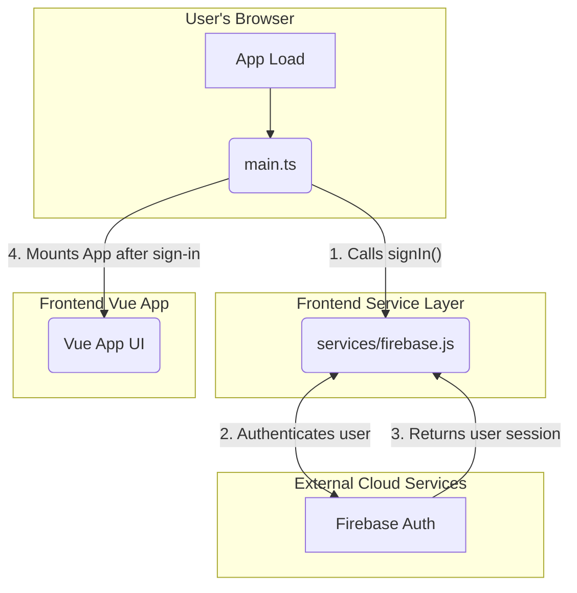
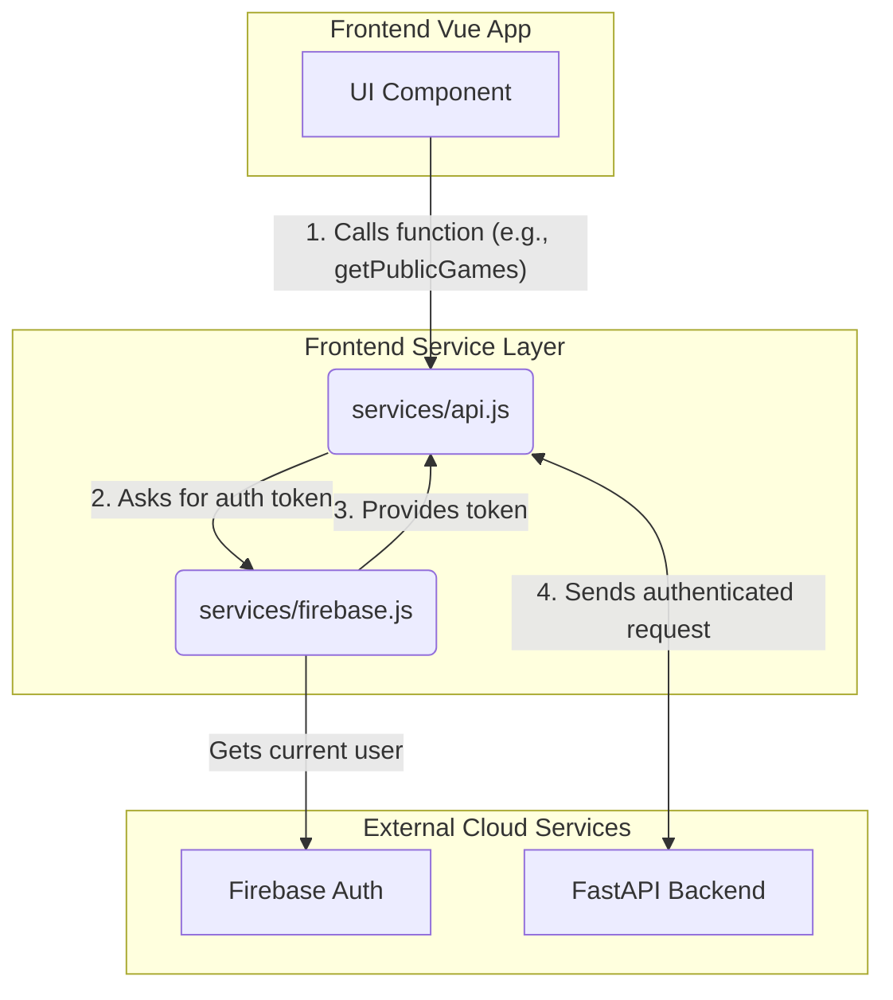

# Frontend Architecture Overview

This document provides a high-level overview of the frontend application for the AI Impostor Game.

## 1. Core Architecture

The frontend is a **Vue.js 3 Single Page Application (SPA)** built with Vite. It is responsible for all UI rendering and client-side interactions.

At its core, the architecture is designed around a clear separation of concerns between the **UI Components** (the "View" layer) and a foundational **Service Layer** (the "Logic" layer). The service layer handles all external communications, such as authentication and backend API calls.

## 2. Key Modules & Roles

The application's logic is primarily organized into three foundational service modules.

### a. `main.ts` (The Orchestrator)

*   **Role**: The primary entry point of the Vue application.
*   **Function**: It bootstraps the entire app by creating the root Vue instance, registering essential plugins (Vue Router, Pinia), and orchestrating the critical startup sequence.

### b. `services/firebase.js` (The Identity Manager)

*   **Role**: A dedicated module for all interactions with the Firebase platform.
*   **Function**: It manages the connection to Firebase and handles the user authentication flow. It provides functions like `signIn()` to establish an anonymous user session and `getCurrentUser()` to securely retrieve the user's identity.

### c. `services/api.js` (The Backend Communicator)

*   **Role**: The bridge between the Vue application and our custom FastAPI backend.
*   **Function**: It abstracts the complexity of HTTP requests. It exports a clean set of functions (e.g., `getPublicGames()`) that UI components can call. Internally, it handles attaching the user's Firebase ID Token to every request for secure, authenticated communication.

## 3. Application Flow

The modules interact in a precise sequence to ensure the application starts up and operates reliably.

### Startup Flow

1.  **App Start**: The browser executes `main.ts`.
2.  **Authentication**: `main.ts` immediately calls `signIn()` from the Firebase service.
3.  **Firebase Sync**: The Firebase service communicates with Google's servers to establish an anonymous user session.
4.  **App Mount**: Only *after* the user session is confirmed does `main.ts` mount the Vue application, ensuring a valid user is always present before the UI is rendered.

### API Request Flow

1.  **User Action**: A UI component (e.g., a "Refresh" button) calls a function from `api.js`.
2.  **Token Retrieval**: The `api.js` module first calls the `firebase.js` module to get the current user's secure ID token.
3.  **Authenticated Call**: The API module attaches the token as a `Bearer` token in the `Authorization` header and sends the request to the FastAPI backend, which can then verify the user's identity.

## 4. State Management with Pinia

### a. What is Pinia?

Pinia is the official state management library for Vue.js. It provides a centralized **store** to hold data that needs to be shared across multiple components.

Think of the store as a central whiteboard in an office. Any component (room) can read information from the whiteboard or request an update. This ensures every component is looking at the same, single source of truth, and the data remains consistent throughout the application.

A Pinia store is built on three core concepts:
*   **State**: The raw, reactive data held in the store (e.g., a list of games).
*   **Getters**: Computed properties that derive data from the state (e.g., a boolean `isInGame`).
*   **Actions**: Methods that are allowed to modify the state. Actions are where business logic, such as calling an API, resides.

### b. Our `useGameStore` Design

The `useGameStore` will be the single source of truth for all shared game state.

*   **Function**: Its primary role is to communicate with our `api.js` service to fetch and send data, and to hold that data in a reactive state that our UI components can consume.

*   **State Properties**:
    *   `publicGames: Array`: An array to hold the list of joinable games for the lobby screen.
    *   `currentGame: Object | null`: A comprehensive object holding the full real-time state of the game a user is currently in. It is `null` if the user is not in a game.
    *   `isLoading: Boolean`: A flag for showing loading indicators in the UI during asynchronous operations.

*   **Key Actions**:
    *   `fetchPublicGames()`: Calls the API to get the list of public games and saves it to the `publicGames` state.
    *   `createGame(settings)`: Calls the API to create a new game.
    *   `joinGame(gameId)`: Calls the API to join an existing game.
    *   `setCurrentGame(gameData)`: A synchronous action used by our Firestore listener to update the `currentGame` state with the latest data from the database.
    *   `leaveGame()`: Resets the `currentGame` state to `null`.
